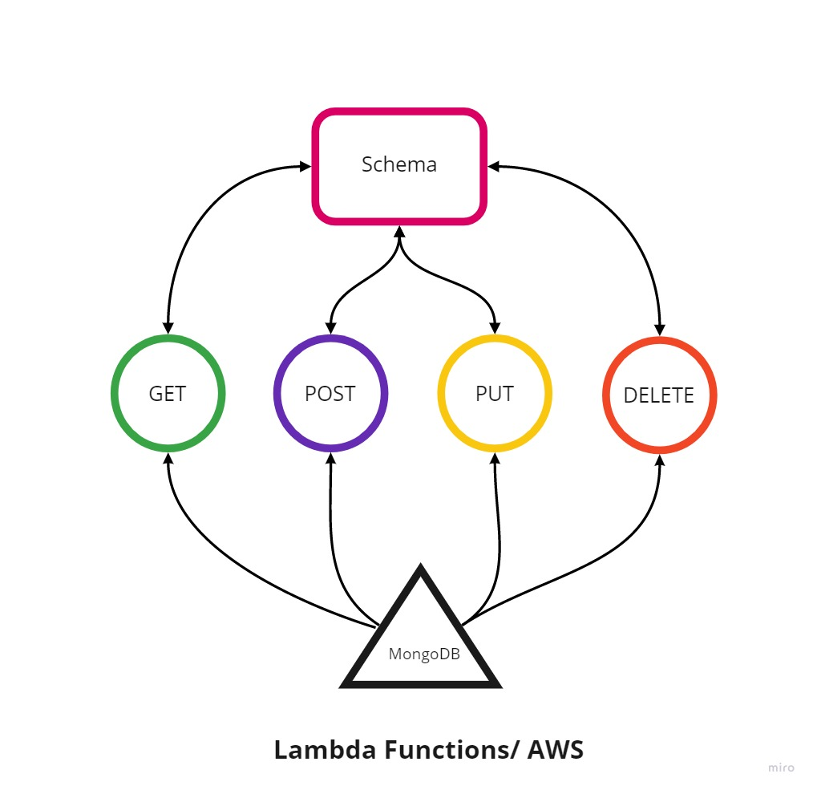

# serverless-api

- Root URL: https://7gcahnuia4.execute-api.us-east-1.amazonaws.com

- Routs:
- GET: https://7gcahnuia4.execute-api.us-east-1.amazonaws.com/people
- GET/id: https://7gcahnuia4.execute-api.us-east-1.amazonaws.com/people/{id} 
- POST: https://7gcahnuia4.execute-api.us-east-1.amazonaws.com/people 
- PUT: https://7gcahnuia4.execute-api.us-east-1.amazonaws.com/people/{id} 
- DELETE: https://7gcahnuia4.execute-api.us-east-1.amazonaws.com/people/{id}

|     Method      |     Input    |  Output |
|-----------------|--------------|---------|
|     GET         |  nothing     |  array of all data in DB |
|     GET/id      |  id          |  object with id matching the input id |
|     POST        |  new object in event.body | the new object created |
|     PUT         |  id & new object| the new object that got updated |
|     DELETE      |  id          | empty object |

## UML
